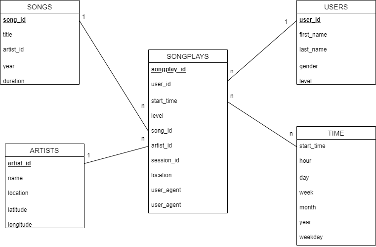

##I. Introduction
###1. About Sparkify
   - Sparkify is a start-up with their music streaming app. They want to analyze the data they've been collecting on songs and user activities on their app, so on understanding user using behavior.
###2. Problem
   - Their problem is their data has been resided in JSON files. Not easy to query the data to analyzing.
###3. Solution
   - Create a database includes 5 tables: songs, artists, users, song_play, and time.
   - Read JSON file and load data to earlier created database.
##II. Database schema design

##III. How to run the Python scripts
   - Open terminal. Run "cd \<file location path\>". Then run "py \<file name\>".
##IV. File organization
   - File sql_queries.py includes all SQL scripts: drop table, create table, insert data, select.
   - File create_tables.py to execute the SQL scripts by Python: create database, create table, drop table.
   - File etl.py to load, transform, and save data to the new files.